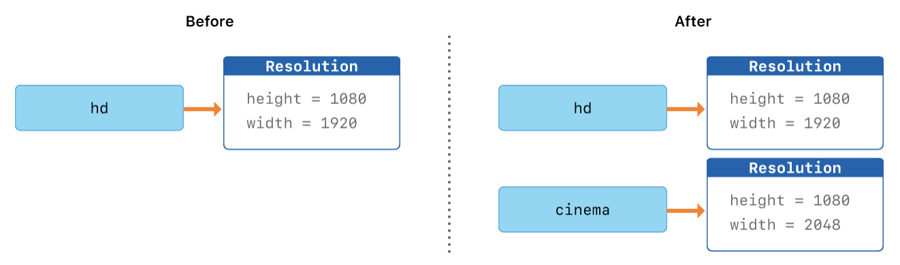

# **Classes & Structures**
> - 다른 프로그래밍 언어와는 달리, Swift는 사용자 클래스와 구조체를 위해서 인터페이스 파일과 구현 파일을 나누어서 만들 필요가 없음.
> - Swift에서는 한 파일에서 클래스나 구조체를 정의하며, 다른 코드에서 사용하기 위한 그 클래스와 구조체의 외부 인터페이스는 자동적으로 생성됨.

## Class VS. Structure
#### 공통점
- 프로퍼티, 메서드, 서브스크립트, Initializer 정의
- 기능 확장(Extension) 가능
- 프로토콜을 채택
  > ** Protocol
    - 
    - 자세한 건 [Protocol]() 문서에서 다룰 예정

#### 차이점
- Structure와 Enum은 Value type, Class는 Reference type
  > ** 예제
  > 
  ``` swift
  let num1: Int = 5
  let num2: Int = num1
  let person: Person = Person()
  let person2: Person = person
  ```
- Class만 가능
  - 상속, 오버라이드
  - 타입 변환(TypeCasting)
  - 인스턴스 할당 해제(Deinitializer)
  - 참조 카운팅(Reference counting)
    > ** ARC (Auto Reference Counting)
    > - 자동으로 객체 참조 카운팅을 관리해주는 iOS의 메모리 관리 방법. 카운팅이 0이 될 경우, 더이상 사용되지 않는 메모리로 인식하고 메모리에서 자동으로 해제함.
    > - ARC 이전에는 MRC(Manually Reference Counting)으로 retain, release 키워드를 이용해 수동으로 참조 카운팅을 관리했으나 메모리 관리의 어려움으로 WWCD 2011, iOS 5부터 retain/release 키워드를 컴파일러가 자동으로 코드에 삽입하는 ARC로 변경됨.
    > - Java의 가비지 컬렉터(GC)와 유사하나 차이점으로는 1) GC는 불규칙적인 사이클로 체크하고, 카운팅이 0인 모든 프로퍼티를 휩쓸어 없애지만 ARC는 카운팅이 0이 되는 순간에 해당 인스턴스를 메모리에서 제거함. 2) GC는 런타임에 메모리를 검사하여 앱 퍼포먼스에 악영향을 줄 수 있지만 ARC는 컴파일단에서 처리하여 성능저하를 유발하지 않음.

## Structure  
- Swift의 기본 데이터 타입(Int, Float, Double, String, Array, Dictionary)은 모두 Structure로 이루어져 있음.
    > Swift에서 Array는 Structure, NSArray(Objective-C)는 Class
  
>  예제
```swift
struct Resolution {
    var width = 0
    var height = 0
}

// Structure는 자동으로 memberwise inializer를 생성해줌
let hd = Resolution(width: 1920, height: 1080)

var cinema = hd
cinema.width = 2048

print("cinema is now \(cinema.width) pixels wide")
// Prints "cinema is now 2048 pixels wide"
```



- `hd` 인스턴스를 `cinema`에 할당할 때 값 복사가 이루어졌기 때문에 둘은 서로 다른 인스턴스. 즉, 둘은 서로 다른 인스턴스이기 때문에 `cinema`의 `width`를 2048로 할당하더라도 `hd` 인스턴스에 저장되어있는 `width` 값은 아무 영향을 받지 않음.

## Class
#### Reference Type
> 예제
```swift
class VideoMode {
    var resolution = Resolution()
    var interlaced = false
    var frameRate = 0.0
    var name: String?
}

// Class는 memberwise initializer가 없음
let tenEighty = VideoMode()
tenEighty.resolution = hd
tenEighty.interlaced = true
tenEighty.name = "1080i"
tenEighty.frameRate = 25.0

let alsoTenEighty = tenEighty
alsoTenEighty.frameRate = 30.0

print("The frameRate property of tenEighty is now \(tenEighty.frameRate)")
// Prints "The frameRate property of tenEighty is now 30.0"

if tenEighty === alsoTenEighty {
	print("tenEighty and alsoTenEighty refer to the same VideoMode instance.")
}
// Prints "tenEighty and alsoTenEighty refer to the same Resolution instance."
```


- 클래스는 참조 타입이기때문에 `tenEighty`와 `alsoTenEighty`는  동일한 `VideoMode` 인스턴스를 참조
- 식별연산자 `===`, `!==`: 동일한 클래스의 인스턴스를 참조하고 있는지 체크
  > C, C++, Objective-C에서, 메모리 주소를 참조하기 위해 `포인터`를 사용함. C의 포인터와 유사하게 Swift 상수나 변수는 특정 참조 타입의 인스턴스를 참조하지만, 메모리 주소를 직접 가리키진 않으며, 참조를 만들 때 별표(*)를 사용하여 나타낼 필요가 없음. (C의 포인터와 비슷한 이 개념은 값 자체를 가지는게 아니라 값을 보관하고 있는 메모리 포인터를 가지고 있다고 볼 수 있다.)

#### 활용
```swift
protocol StudentProtocol {
    var name: String { get }
    var age: Int { get }
    
    func introduce()
    func eatLunchAtSchool()
    func setGrade(score: Int)
    func getGrade() -> String
}

// StudentProtocol을 준수하는 Student class 생성
class Student: StudentProtocol {
    var name: String
    var age: Int
    private var grade: String = ""
    
    // Designated Init
    init(name: String, age: Int) {
        self.name = name
        self.age = age
    }
    
    // Convenience init
    convenience init(name: String) {
        self.init(name: name, age: 19)
    }
    
    func introduce() {
        print("\(self.name)은(는) \(self.age)살 학생입니다.")
    }
    
    func eatLunchAtSchool() {
        print("\(self.name)은(는) 급식을 먹어요")
    }
    
    func setGrade(score: Int){
        guard score <= 100 else { return }        
        switch score {
        case 91...100:
            grade = "A"
        case 81...90:
            grade = "B"
        case 71...80:
            grade = "C"
        default:
            grade = "F"
        }
    }
    
    func getGrade() -> String {
        return "\(self.name)의 Grade는 \(self.grade)"
    }
}

// Student class를 상속
class CollegeStudent: Student {
    var major: String
    
    init(name: String, age: Int, major: String) {
        // super 키워드를 통해 상속받은 Student의 initializer를 사용
        super.init(name: name, age: age)
        self.major = major
    }
  
    // 상속받은 Student class의 introduce()를 Override
    override func introduce() {
        print("\(self.name)은(는) \(self.major)전공의 \(self.age)살 대학생입니다.")
    }
    
    // 상속받은 Student class에 eatLunchAtSchool()가 있지만 받는 매개변수가 다르기 때문에 다른 메서드로 취급
    func eatLunchAtSchool(how: String) {
        print("\(self.name)은(는) 학식을 \(how) 먹어요")
    }
}

let student = Student(name: "Ari", age: 16)
print("----------------< Student >----------------")
student.introduce()
student.eatLunchAtSchool()
student.setGrade(score: 86)
print(student.getGrade())

print("----------------< College Student >----------------")
let collegeStudent = CollegeStudent(name: "Ssung", age: 22, major: "UrbanPlanning")
collegeStudent.introduce()
collegeStudent.eatLunchAtSchool(how: "맛있게")
collegeStudent.setGrade(score: 99)
print(collegeStudent.getGrade())

/* Prints
----------------< Student >----------------
Ari은(는) 16살 학생입니다.
Ari은(는) 급식을 먹어요
Ari의 Grade는 B
----------------< College Student >----------------
Ssung은(는) 22살 대학생입니다.
Ssung은(는) 학식을 맛있게 먹어요
Ssung의 Grade는 A
*/
```
